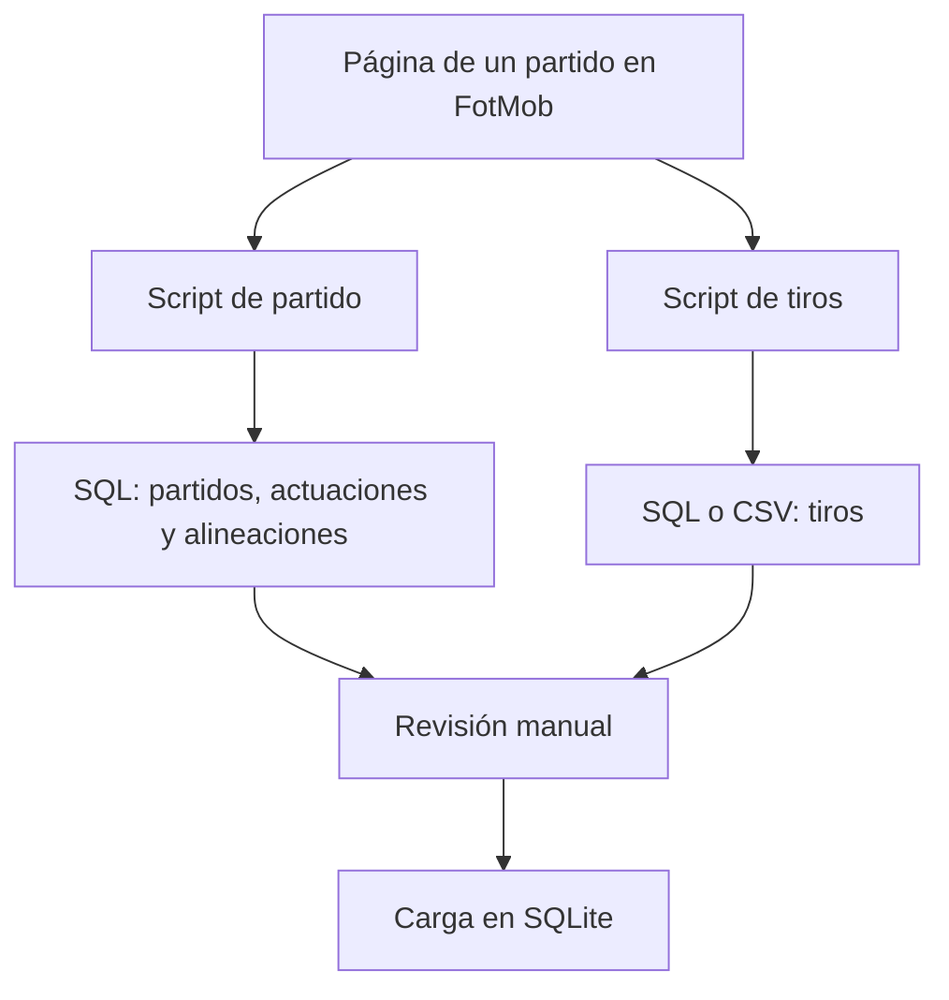

# Scripts de extracción desde FotMob

Esta carpeta documenta los dos *userscripts* de Tampermonkey utilizados para asistir la carga de la base SQLite del proyecto. Ambos archivos son versiones finales y complementarias: no representan dos versiones sucesivas del mismo programa.

| Script | Versión | Alcance | Salida principal |
|---|---:|---|---|
| [`fotmob_partidos_actuaciones_alineaciones.user.js`](fotmob_partidos_actuaciones_alineaciones.user.js) | 3.3 | Datos generales del partido, estadísticas de ambos equipos y alineaciones | Sentencias `INSERT` para `partidos`, `estadisticas_actuaciones` y `alineaciones_partido` |
| [`fotmob_tiros.user.js`](fotmob_tiros.user.js) | 7.3 | Remates individuales del partido | Sentencia `INSERT` para `tiros` y exportación CSV |

## Objetivo dentro del proyecto

Los scripts reducen la transcripción manual de datos visibles o embebidos en las páginas de FotMob. Su función termina en la generación de SQL o CSV: no se conectan directamente con la base SQLite ni ejecutan sentencias sobre ella. Esto permite revisar el resultado antes de incorporarlo al conjunto de datos.



## Requisitos

- Navegador compatible con extensiones de userscripts.
- Extensión Tampermonkey instalada.
- Acceso a una página de partido en `https://www.fotmob.com/`.
- El `id_partido` que se utilizará en la base local.
- La ficha del partido cargada; si faltan datos, conviene abrir las secciones **Stats** o **Lineup** y esperar unos segundos.

## Instalación

1. Abrir el panel de Tampermonkey.
2. Crear un script nuevo.
3. Reemplazar el contenido de ejemplo por uno de los archivos `.user.js` de esta carpeta.
4. Guardarlo y comprobar que esté habilitado.
5. Repetir el proceso con el segundo archivo.

Los botones de ambos scripts pueden convivir en la misma página:

- **Extraer SQL completo**: aparece en color naranja y ejecuta el módulo de partido.
- **Extraer tiros SQL**: aparece en color verde y ejecuta el módulo de tiros.

## Flujo de uso recomendado

1. Abrir el partido correspondiente en FotMob.
2. Verificar que la página haya terminado de cargar.
3. Ejecutar **Extraer SQL completo** e ingresar el `id_partido` de la base local.
4. Copiar el SQL generado para las tres tablas y revisarlo.
5. Ejecutar **Extraer tiros SQL** usando exactamente el mismo `id_partido`.
6. Revisar las advertencias sobre jugadores o arqueros sin identificar.
7. Copiar o descargar el SQL de tiros; el CSV sirve como respaldo para inspección.
8. Ejecutar las sentencias en SQLite respetando el orden de dependencias: primero `partidos`, después `estadisticas_actuaciones`, `alineaciones_partido` y `tiros`.

El `id_partido` solicitado por ambos scripts es el identificador interno del proyecto. No debe confundirse con el `matchId` propio de FotMob.

## Script 1: partido, actuaciones y alineaciones

### Obtención de datos

El script detecta el `matchId` de FotMob en la URL. Primero busca el objeto del partido dentro de `__NEXT_DATA__` o de otros scripts embebidos en la página. Si no lo encuentra, intenta consultar dos rutas de FotMob mediante `GM_xmlhttpRequest`:

```text
https://www.fotmob.com/api/matchDetails?matchId=...
https://www.fotmob.com/matchDetails?matchId=...
```

Este diseño combina una fuente ya presente en el documento con una alternativa de recuperación por HTTP. La segunda opción requiere los permisos `GM_xmlhttpRequest` y `@connect www.fotmob.com` declarados en la cabecera del userscript.

### Normalización de identificadores

- Los equipos se convierten a códigos FIFA de tres letras mediante `TEAM_IDS`, incluyendo variantes de nombres utilizadas por FotMob.
- Los estadios se convierten a los identificadores numéricos de la tabla `estadios` mediante `STADIUM_IDS`.
- Los jugadores se identifican como código de selección más dorsal; por ejemplo, el dorsal 6 de Francia se transforma en `FRA6`.
- El rival se determina a partir de los equipos local y visitante del partido.

Si un equipo o estadio no se encuentra en sus respectivos diccionarios, el script genera una advertencia en la consola. Un estadio no reconocido produce `id_estadio = NULL` en el SQL para evitar asignar un identificador incorrecto.

### Salida para `partidos`

Se genera una fila con los siguientes datos:

| Grupo | Campos |
|---|---|
| Identificación | `id`, `id_equipo_local`, `id_equipo_visitante` |
| Marcador y rendimiento | `goles_local`, `goles_visitante`, `xg_local`, `xg_visitante`, `xgot_local`, `xgot_visitante` |
| Organización táctica | `formacion_local`, `formacion_visitante` |
| Contexto | `id_estadio`, `fecha`, `fase`, `arbitro`, `espectadores` |

La fecha se normaliza como `AAAA-MM-DD` en UTC. El script no genera los campos relacionados con una definición por penales.

### Salida para `estadisticas_actuaciones`

Se generan dos filas por partido, una desde la perspectiva del equipo local y otra desde la del visitante. Los valores a favor y en contra se invierten de forma automática para mantener la misma semántica en ambas filas.

| Grupo | Campos |
|---|---|
| Claves | `id_partido`, `id_equipo`, `id_rival` |
| Contexto | `ranking_equipo`, `ranking_rival`, `goles_favor`, `goles_contra` |
| Producción ofensiva | `xg_favor`, `xg_contra`, `tiros_favor`, `tiros_contra`, `tiros_arco_favor`, `tiros_arco_contra` |
| Ocasiones y territorio | `big_chances_favor`, `big_chances_contra`, `big_chances_missed`, `toques_area_rival`, `toques_area_propia_concedidos` |
| Posesión y pase | `posesion`, `pases_totales`, `pases_acertados`, `precision_pases` |
| Recuperación y disciplina | `recuperaciones`, `intercepciones`, `faltas`, `tarjetas_amarillas`, `tarjetas_rojas` |

FotMob presenta los pases precisos como una cantidad acompañada por un porcentaje. El script conserva ambos valores y estima `pases_totales` dividiendo los pases acertados por la precisión y redondeando el resultado.

### Salida para `alineaciones_partido`

El script reúne titulares y suplentes de ambos equipos y genera una fila por jugador incluido en la alineación disponible.

| Decisión | Implementación |
|---|---|
| Titularidad | `condicion` distingue `titular` y `suplente`. |
| Participación | `jugo` permite diferenciar a un suplente que ingresó de otro que permaneció en el banco. |
| Minutos | Un titular comienza en el minuto 0; los eventos de sustitución completan ingreso y salida. |
| Sustituciones | `id_jugador_reemplaza_a` e `id_jugador_reemplazado_por` vinculan a los dos participantes del cambio. |
| Posición | `posicion_general` normaliza a `GK`, `DF`, `MF` o `FW`; `posicion_detalle` intenta conservar la etiqueta más específica publicada por la fuente. |

Cuando FotMob no ofrece una posición detallada, el script utiliza la posición general como respaldo. Los minutos de descuento se expresan sumando el minuto base y el adicional del evento.

## Script 2: tiros

### Obtención de datos

Este script trabaja exclusivamente con el objeto `__NEXT_DATA__` ya incluido en la página y, por lo tanto, declara `@grant none`. Busca el mapa de tiros en varias rutas conocidas y dispone de una búsqueda recursiva de respaldo para tolerar variaciones en la estructura del JSON.

También recorre las alineaciones y el contenido del partido para construir un mapa entre los identificadores internos de jugadores de FotMob y los identificadores deportivos de la base (`selección + dorsal`).

### Salida para `tiros`

Cada remate genera una fila con la siguiente información:

| Grupo | Campos |
|---|---|
| Claves | `id_partido`, `id_equipo`, `id_jugador`, `id_arquero` |
| Momento | `minuto`, `minuto_adicional`, `periodo` |
| Resultado y calidad | `resultado`, `xg`, `xgot` |
| Origen del remate | `coordenada_x`, `coordenada_y` |
| Ubicación en el arco | `goal_crossed_y`, `goal_crossed_z`, `on_goal_shot_x`, `on_goal_shot_y` |
| Clasificación | `tipo_tiro`, `situacion`, `es_al_arco`, `es_dentro_area` |

Los campos internos usados para depuración —nombre del jugador y los identificadores de FotMob— se muestran en la consola, pero se eliminan del SQL y del CSV final.

El campo `id_equipo_gol` no forma parte del `INSERT` generado por este script. Por ello queda fuera de esta automatización y debe revisarse en la etapa de carga cuando sea necesario identificar a qué selección se contabiliza un gol, especialmente en los autogoles.

### Controles incorporados

- Rechaza un `id_partido` vacío o no numérico.
- Informa cuántos tiros fueron encontrados.
- Cuenta y muestra los tiros sin `id_jugador` resuelto.
- Advierte cuando FotMob informa un arquero, pero no se pudo construir su identificador local.
- Permite copiar el SQL, descargarlo como `.sql` y copiar o descargar los mismos datos como CSV.
- La tecla `Escape` cierra el panel de resultados.

## Decisiones comunes de generación SQL

- Los nombres de las columnas se incluyen explícitamente en cada `INSERT` para no depender del orden físico de la tabla.
- Los valores ausentes se escriben como `NULL` cuando los conversores del script los reconocen como vacíos.
- Los textos escapan las comillas simples duplicándolas, de acuerdo con la sintaxis SQL.
- Los valores booleanos se convierten a `0` y `1` para SQLite.
- Se generan bloques `VALUES` múltiples para reducir operaciones de copiado y ejecución.
- Los scripts no generan `id_tiro`: SQLite lo asigna mediante la clave autoincremental de la tabla.

## Revisión antes de cargar

La extracción automatizada no reemplaza el control de calidad. Antes de ejecutar el SQL conviene comprobar:

1. Que el `id_partido` corresponda al mismo encuentro en ambos scripts.
2. Que los códigos de local, visitante y rival coincidan con la tabla `equipos`.
3. Que los identificadores de jugadores combinen la selección y el dorsal correctos.
4. Que no haya `NULL` inesperados en jugadores, estadio o campos obligatorios.
5. Que la cantidad de tiros coincida con la mostrada por FotMob.
6. Que los cambios, minutos y condición de los jugadores sean coherentes con el desarrollo del partido.
7. Que los goles y autogoles reciban el tratamiento correspondiente en `id_equipo_gol`.

## Mantenimiento

Los scripts dependen de la estructura de datos y los nombres publicados por FotMob. Si la plataforma modifica su JSON, pueden requerirse ajustes en:

- Las rutas usadas para localizar estadísticas, alineaciones o tiros.
- Los alias de equipos en `TEAM_IDS` y `COUNTRY_BY_TEAM_NAME`.
- El diccionario `STADIUM_IDS`.
- Los nombres de las métricas buscadas por clave o título.

Los dos diccionarios de equipos viven en archivos diferentes. Cuando se agrega o corrige un alias conviene verificar ambos para conservar una normalización uniforme.

## Seguridad y alcance

La revisión de estas versiones no encontró claves de API, contraseñas, tokens, cookies ni otros secretos incorporados en el código. El primer script realiza solicitudes únicamente a `www.fotmob.com`; el segundo procesa los datos presentes en la página. Ninguno escribe directamente en la base de datos.

Estos scripts fueron creados con fines educativos y de portfolio. FotMob conserva los derechos sobre su marca y sus contenidos, y puede establecer condiciones propias para el acceso y uso de sus datos.

## Solución de problemas

| Problema | Comprobación sugerida |
|---|---|
| No aparece el botón | Confirmar que Tampermonkey esté habilitado, recargar la página y esperar entre dos y tres segundos. |
| No se detecta el partido | Abrir una URL individual de partido que contenga su identificador de FotMob. |
| No se obtiene el JSON | Abrir **Stats** o **Lineup**, esperar la carga y volver a ejecutar. |
| No se encuentran tiros | Verificar que el partido tenga mapa de tiros y revisar los objetos mostrados en la consola del navegador. |
| Aparece un equipo sin código FIFA | Agregar el nombre exacto publicado por FotMob al diccionario del script afectado. |
| `id_estadio` resulta `NULL` | Incorporar el nombre exacto del estadio a `STADIUM_IDS` después de verificar su correspondencia. |
| Faltan jugadores o arqueros | Comprobar dorsales y alineaciones; revisar las advertencias y la tabla mostrada en la consola. |

