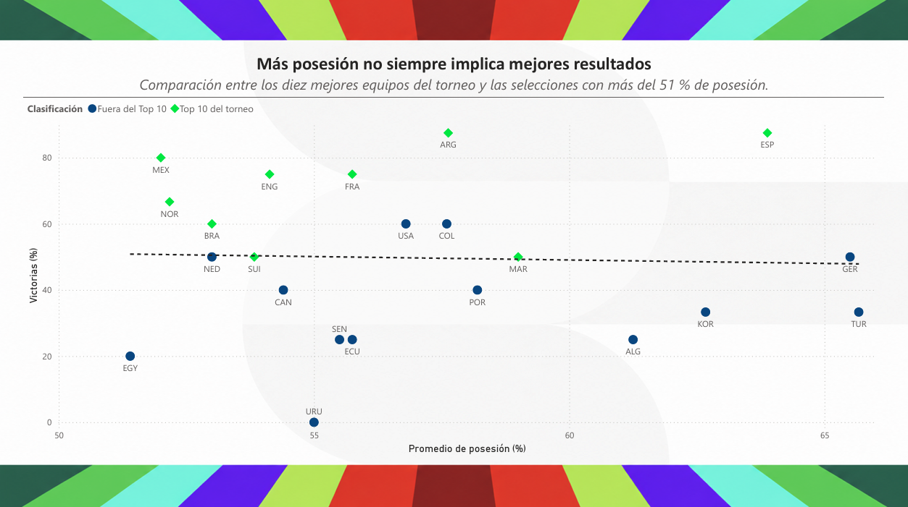
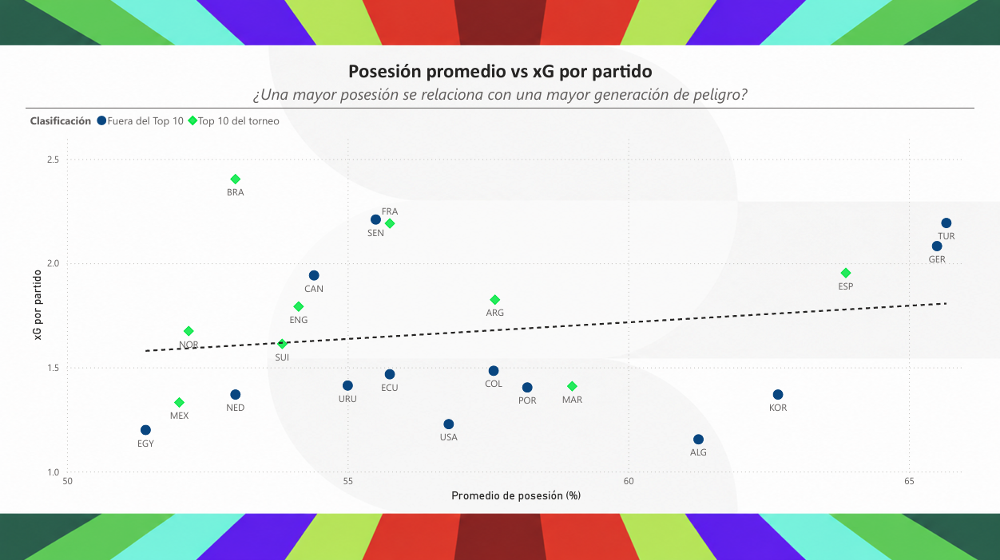

# Visualizaciones en Power BI

Estas visualizaciones analizan la relación entre la posesión del balón, la generación de peligro y los resultados obtenidos durante el torneo.

## Posesión y porcentaje de victorias

La muestra incluye los diez equipos mejor posicionados del torneo y las selecciones con más del 51 % de posesión promedio. El gráfico evidencia que controlar mayoritariamente la pelota no garantiza un porcentaje superior de victorias.

## Posesión y goles esperados

La visualización estudia si una mayor posesión se relaciona con una mayor generación de peligro mediante el promedio de goles esperados por partido.